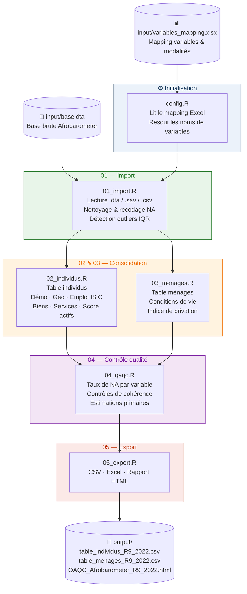

<div align="center">

<h1>🇸🇳 SEN AFROBAROMETER PIPELINE</h1>
<h3>Pipeline de traitement des données d'opinion — ENSAE Dakar</h3>


<br/>

[](LICENSE)
[](https://www.r-project.org/)
[](https://www.afrobarometer.org/countries/senegal/)
[](https://www.ensae.sn/)

</div>

---

## À propos

Ce projet, réalisé dans le cadre de la formation **ISE (Ingénieurs Statisticiens Économistes)** à l'ENSAE Dakar, fournit un **pipeline reproductible et scalable** de traitement des données Afrobarometer Sénégal.

Il produit deux tables analytiques structurées — **individus** et **ménages** — ainsi qu'un **rapport QAQC interactif en HTML**, le tout sans aucune intervention manuelle dans le code entre deux rounds d'enquête.

---

## Schéma du pipeline



---

## Structure du projet

```
SEN-AFROBAROMETER-PIPELINE-ENSAE/
│
├── 📄 main.R                        ← Point d'entrée unique du pipeline
│
├── 📂 input/
│   ├── base.dta                     ← Base brute Afrobarometer (à déposer ici)
│   └── variables_mapping.xlsx       ← Mapping variables & modalités (éditable par round)
│
├── 📂 output/                       ← Générés automatiquement à l'exécution
│   └── qaqc/
│
└── 📂 R/
    ├── config.R                     ← Lit le mapping Excel, configure le pipeline
    ├── utils.R                      ← Fonctions utilitaires partagées
    ├── 01_import.R                  ← Import, nettoyage, détection outliers
    ├── 02_individus.R               ← Table individus consolidée
    ├── 03_menages.R                 ← Table ménages consolidée
    ├── 04_qaqc.R                    ← Contrôle qualité + estimations primaires
    ├── 05_export.R                  ← Export CSV / Excel / HTML
    └── qaqc_report.Rmd              ← Template rapport QAQC HTML
```

---

## Démarrage rapide

### Étape 1 — Installer les packages R

```r
install.packages(c(
  "haven", "labelled", "dplyr", "tidyr", "purrr",
  "stringr", "here", "readxl", "tibble",
  "rmarkdown", "knitr", "kableExtra", "ggplot2", "openxlsx"
))
```

### Étape 2 — Déposer la base brute

```
input/base.dta        ← formats acceptés : .dta · .sav · .csv
```

### Étape 3 — Lancer le pipeline

```r
source("main.R")
```

```bash
# ou en ligne de commande
Rscript main.R
```

### Résultats générés

```
output/
├── table_individus_R9_2022.csv          ← 1 200 individus × variables structurées
├── table_menages_R9_2022.csv            ← 1 200 ménages × conditions de vie
└── qaqc/
    ├── QAQC_Afrobarometer_R9_2022.html  ← Rapport interactif complet
    └── QAQC_Afrobarometer_R9_2022.xlsx  ← Rapport Excel colorisé
```

---

## Variables produites

<details>
<summary><b>📋 Table individus</b></summary>

| Groupe | Variables |
|--------|-----------|
| 👤 **Démographiques** | Âge, genre, niveau d'instruction, langue du domicile |
| 🗺️ **Géographiques** | Région (14), département, milieu urbain/rural, commune |
| 💼 **Emploi** | Statut d'emploi, secteur ISIC Rev 4, activité principale & secondaire |
| 🏠 **Biens possédés** | Radio, TV, véhicule, ordinateur, téléphone, internet, score d'actifs |
| 💧 **Services sociaux** | Source d'eau, assainissement, accès et fréquence de l'électricité |

</details>

<details>
<summary><b>📋 Table ménages</b></summary>

| Groupe | Variables |
|--------|-----------|
| 👤 **Profil répondant** | Mêmes variables démographiques |
| 🗺️ **Localisation** | Région, département, milieu, commune, arrondissement |
| 💧 **Services zone** | Eau, assainissement, électricité dans la zone |
| 📉 **Conditions de vie** | Privations alimentation, eau, soins, combustible, revenus |
| 📊 **Indice de privation** | Score composite 0–5 + groupe de privation |

</details>

---

## Rapport QAQC

Le rapport HTML généré automatiquement comprend :

| Section | Contenu |
|---------|---------|
| 📐 **Taille des bases** | Base brute vs bases traitées — observations et variables |
| 📊 **Indicateurs clés** | Cartes métriques colorisées (vert / orange / rouge) |
| 🔍 **Valeurs manquantes** | Taux de NA par variable, seuils alerte (>20 %) et critique (>50 %) |
| ⚠️ **Valeurs aberrantes** | Détection IQR × 3 sur variables numériques |
| ✅ **Contrôles cohérence** | Unicité identifiants, plages d'âge |
| 📈 **Estimations primaires** | Distributions genre, éducation, région, emploi, ISIC, privation |

---

## Changer de round sans toucher au code

> Le pipeline est **scalable par conception** grâce au fichier `input/variables_mapping.xlsx`.

```
┌─────────────────────────────────────────────────────────────┐
│  WORKFLOW NOUVEAU ROUND                                     │
│                                                             │
│  1. Remplacer input/base.dta  par la nouvelle base          │
│                                                             │
│  2. Dans R/config.R, mettre à jour :                        │
│     ROUND <- list(numero = 10, annee = 2025, pays = "SEN")  │
│     FICHIER_BRUT <- "base_r10.dta"                          │
│                                                             │
│  3. Dans variables_mapping.xlsx, remplir les colonnes 🟡 :  │
│     · Feuille "Variables"  → nouveaux noms de colonnes      │
│     · Feuille "Modalités"  → nouveaux libellés de codes     │
│                                                             │
│  4. Relancer main.R  ✓                                      │
└─────────────────────────────────────────────────────────────┘
```

> Les cellules laissées vides conservent automatiquement les noms du round précédent.

---

## Source des données

> **[Afrobarometer](https://www.afrobarometer.org/countries/senegal/)** est un programme panafricain de recherche par enquêtes mesurant les attitudes citoyennes sur la démocratie, la gouvernance et les conditions de vie.

**Round 9 Sénégal — 2022** : 1 200 répondants · 1 487 variables

---

## Équipe

<div align="center">

| Nom | Formation |
|-----|-----------|
| Ibrahim ADAM ALASSANE | ISE — ENSAE Dakar |
| Moussa DIAKITE | ISE — ENSAE Dakar |
| Fallou NGOM | ISE — ENSAE Dakar |
| Cheikh Sadibou NGOM | ISE — ENSAE Dakar |
| Gnalen SANGARE | ISE — ENSAE Dakar |
| Seman Giovanni Jocelyn GADO | ISE — ENSAE Dakar |
| Sié Rachid TRAORE | ISE — ENSAE Dakar |

**Superviseur : M. MBodj — ENSAE Dakar**

</div>

---

<div align="center">
  <sub>🎓 ENSAE Dakar · Formation ISE · Promotion 2022–2025</sub>
</div>
