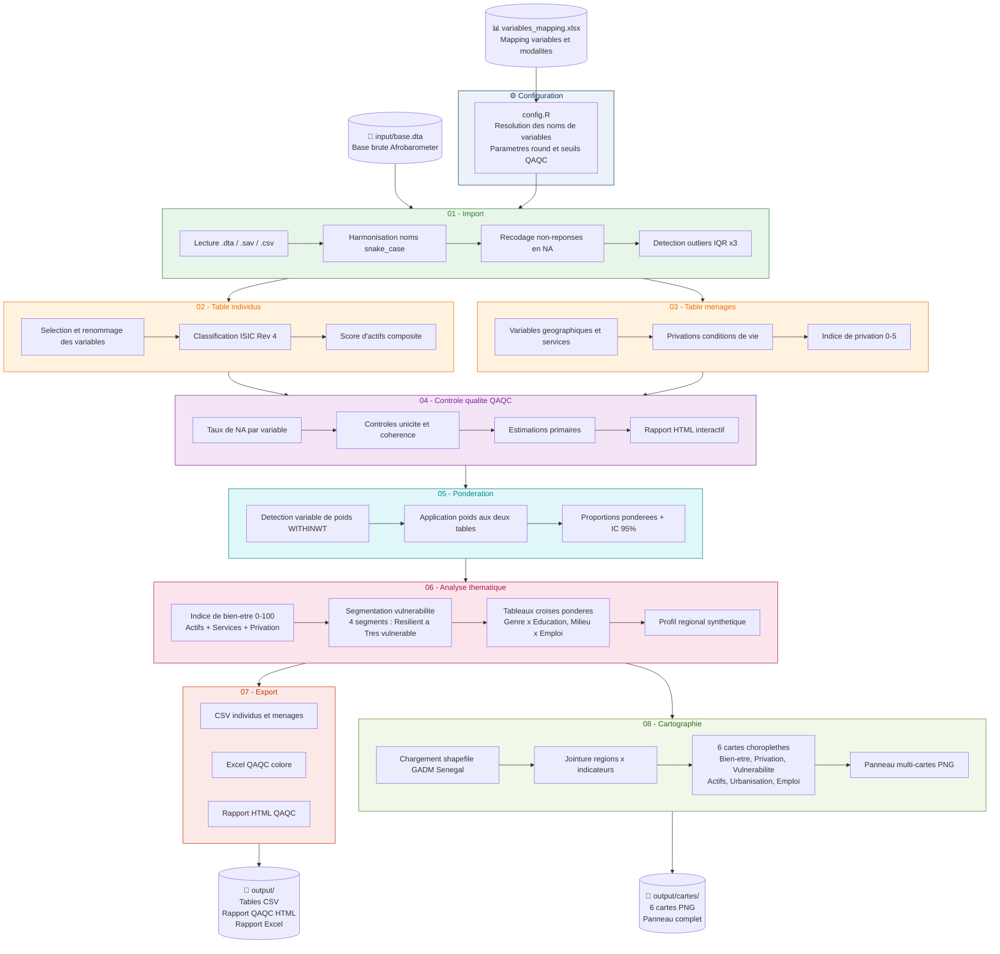

<div align="center">


<br/>

[](LICENSE)
[](https://www.r-project.org/)
[](https://www.afrobarometer.org/countries/senegal/)
[](https://www.ensae.sn/)

</div>


## A propos

Ce projet, realise dans le cadre de la formation **ISE (Ingenieurs Statisticiens Economistes)** a l'ENSAE Dakar, fournit un **pipeline reproductible et scalable** de traitement des donnees Afrobarometer Senegal.

Il produit deux tables analytiques structurees (**individus** et **menages**), des estimations ponderees avec intervalles de confiance, des indicateurs composites de bien-etre et de vulnerabilite, ainsi qu'un **rapport QAQC interactif en HTML**.


## Schema du pipeline




## Structure du projet

```
SEN-AFROBAROMETER-PIPELINE-ENSAE/
|
+-- main.R                        <- Point d'entree unique du pipeline (8 etapes)
+-- install_packages.R            <- Script d'installation des dependances
|
+-- input/
|   +-- base.dta                  <- Base brute Afrobarometer (a deposer ici)
|   +-- variables_mapping.xlsx    <- Mapping variables et modalites (editable par round)
|
+-- output/                       <- Generes automatiquement a l'execution
|   +-- qaqc/
|   +-- cartes/                   <- Cartes PNG generees par 08_cartographie.R
|
+-- R/
    +-- config.R                  <- Lit le mapping Excel, configure le pipeline
    +-- utils.R                   <- Fonctions utilitaires partagees
    +-- 01_import.R               <- Import, nettoyage, detection outliers
    +-- 02_individus.R            <- Table individus consolidee
    +-- 03_menages.R              <- Table menages consolidee
    +-- 04_qaqc.R                 <- Controle qualite et estimations primaires
    +-- 05_ponderation.R          <- Poids d'enquete et estimations ponderees IC 95%
    +-- 06_analyse.R              <- Indices composites, vulnerabilite, tableaux croises
    +-- 07_export.R               <- Export CSV / Excel / HTML
    +-- 08_cartographie.R         <- Cartes choroplethes par region (sf + ggplot2)
    +-- qaqc_report.Rmd           <- Template rapport QAQC HTML
```


## Demarrage rapide

### Etape 1 - Installer les packages R

Lancer le script d'installation fourni (gere les dependances systeme de `sf`) :

```r
source("install_packages.R")
```

```bash
# ou en ligne de commande
Rscript install_packages.R
```

Le script installe automatiquement les 3 groupes de packages, verifie les
dependances systeme GDAL/GEOS/PROJ necessaires pour la cartographie, et
affiche un bilan clair. Les packages de cartographie (`sf`, `geodata`,
`patchwork`) sont optionnels : si leur installation echoue, le pipeline
continue sans l'etape 08.

> **Linux / WSL** : si `sf` echoue, installer d'abord les libs systeme :
> ```bash
> sudo apt-get install -y libgdal-dev libgeos-dev libproj-dev
> ```
> puis relancer `install_packages.R`.

### Etape 2 - Deposer la base brute

```
input/base.dta        <- formats acceptes : .dta / .sav / .csv
```

### Etape 3 - Lancer le pipeline

```r
source("main.R")
```

```bash
# ou en ligne de commande
Rscript main.R
```

### Resultats generes

```
output/
+-- table_individus_R9_2022.csv          <- 1 200 individus x variables enrichies
+-- table_menages_R9_2022.csv            <- 1 200 menages x conditions de vie
+-- qaqc/
|   +-- QAQC_Afrobarometer_R9_2022.html <- Rapport interactif complet
|   +-- QAQC_Afrobarometer_R9_2022.xlsx <- Rapport Excel colorise
+-- cartes/
    +-- carte_bien_etre.png              <- Indice de bien-etre par region
    +-- carte_privation.png              <- Indice de privation par region
    +-- carte_vulnerabilite.png          <- Taux de vulnerabilite severe
    +-- carte_actifs.png                 <- Score d'actifs par region
    +-- carte_urbanisation.png           <- Taux d'urbanisation
    +-- carte_emploi.png                 <- Precarite de l'emploi
    +-- carte_panneau_complet.png        <- Toutes les cartes assemblees
```


## Variables produites

<details>
<summary><b>📋 Table individus</b></summary>

| Groupe | Variables |
|--------|-----------|
| 👤 **Demographiques** | Age, genre, niveau d'instruction, langue du domicile |
| 🗺️ **Geographiques** | Region (14), departement, milieu urbain/rural, commune |
| 💼 **Emploi** | Statut d'emploi, secteur ISIC Rev 4, activite principale et secondaire |
| 🏠 **Biens possedes** | Radio, TV, vehicule, ordinateur, telephone, internet, score d'actifs |
| 💧 **Services sociaux** | Source d'eau, assainissement, acces et frequence de l'electricite |
| ⚖️ **Poids d'enquete** | Variable `poids` issue de WITHINWT (ou poids unitaire si absente) |
| 📊 **Indices calcules** | Indice de bien-etre (0-100), score de vulnerabilite, segment de vulnerabilite |

</details>

<details>
<summary><b>📋 Table menages</b></summary>

| Groupe | Variables |
|--------|-----------|
| 👤 **Profil repondant** | Memes variables demographiques |
| 🗺️ **Localisation** | Region, departement, milieu, commune, arrondissement |
| 💧 **Services zone** | Eau, assainissement, electricite dans la zone |
| 📉 **Conditions de vie** | Privations alimentation, eau, soins, combustible, revenus |
| 📊 **Indice de privation** | Score composite 0-5 et groupe de privation |
| ⚖️ **Poids d'enquete** | Variable `poids` issue de WITHINWT |

</details>

<details>
<summary><b>📊 Sorties analytiques avancees</b></summary>

| Sortie | Description |
|--------|-------------|
| Estimations ponderees | Proportions + IC 95% pour genre, region, emploi, ISIC |
| Indice de bien-etre | Score composite 0-100 (actifs + services + privation) |
| Segmentation vulnerabilite | 4 segments : Resilient, Vulnerable modere, Vulnerable, Tres vulnerable |
| Tableaux croises ponderes | Genre x Education, Milieu x Emploi, Region x Vulnerabilite |
| Profil regional | Tableau synthetique par region (privation, emploi, actifs, urbanisation) |
| Cartes choroplethes | 6 cartes PNG + panneau assemble (fond GADM, geom_sf, patchwork) |

</details>


## Rapport QAQC

Le rapport HTML genere automatiquement comprend :

| Section | Contenu |
|---------|---------|
| 📐 **Taille des bases** | Base brute vs bases traitees - observations et variables |
| 📊 **Indicateurs cles** | Cartes metriques colorisees (vert / orange / rouge) |
| 🔍 **Valeurs manquantes** | Taux de NA par variable, seuils alerte (>20%) et critique (>50%) |
| ⚠️ **Valeurs aberrantes** | Detection IQR x3 sur variables numeriques |
| ✅ **Controles coherence** | Unicite identifiants, plages d'age |
| 📈 **Estimations primaires** | Distributions genre, education, region, emploi, ISIC, privation |


## Changer de round sans toucher au code

> Le pipeline est **scalable par conception** grace au fichier `input/variables_mapping.xlsx`.

```
+-------------------------------------------------------------+
|  WORKFLOW NOUVEAU ROUND                                     |
|                                                             |
|  1. Remplacer input/base.dta  par la nouvelle base          |
|                                                             |
|  2. Dans R/config.R, mettre a jour :                        |
|     ROUND <- list(numero = 10, annee = 2025, pays = "SEN")  |
|     FICHIER_BRUT <- "base_r10.dta"                          |
|                                                             |
|  3. Dans variables_mapping.xlsx, remplir les colonnes 🟡 :  |
|     . Feuille "Variables"  -> nouveaux noms de colonnes     |
|     . Feuille "Modalites"  -> nouveaux libellesde codes     |
|                                                             |
|  4. Relancer main.R  ✓                                      |
+-------------------------------------------------------------+
```

> Les cellules laissees vides conservent automatiquement les noms du round precedent.


## Source des donnees

> **[Afrobarometer](https://www.afrobarometer.org/countries/senegal/)** est un programme panafricain de recherche par enquetes mesurant les attitudes citoyennes sur la democratie, la gouvernance et les conditions de vie.

**Round 9 Senegal - 2022** : 1 200 repondants, 1 487 variables.


## Equipe

<div align="center">

| Nom | Formation |
|-----|-----------|
| Ibrahim ADAM ALASSANE | ISE - ENSAE Dakar |
| Moussa DIAKITE | ISE - ENSAE Dakar |
| Fallou NGOM | ISE - ENSAE Dakar |
| Cheikh Sadibou NGOM | ISE - ENSAE Dakar |
| Gnalen SANGARE | ISE - ENSAE Dakar |
| Seman Giovanni Jocelyn GADO | ISE - ENSAE Dakar |
| Sie Rachid TRAORE | ISE - ENSAE Dakar |

**Superviseur : M. MBodj - ENSAE Dakar**

</div>


